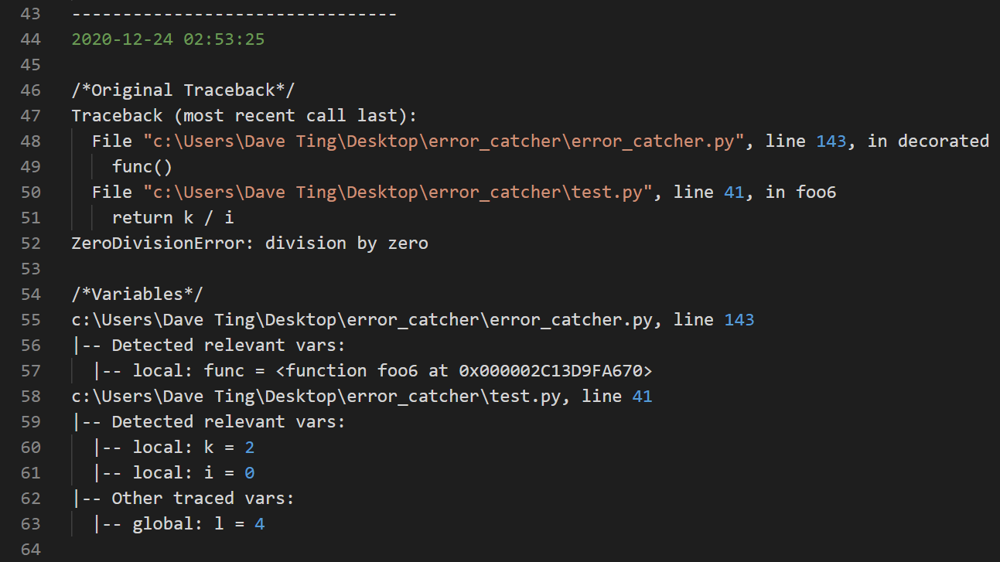

# Error Catcher

Convenient and comprehensive traceback decorator for Python scripts.

To use this decorator, simply attach it to your function:

```python
from error_catcher import silent

@silent(key_vars=[], log_file='', ascending=False)
def func():
    i, j = 1, 0
    return i / j

func()
```

## Parameters

- `key_vars`: list, default `[]`.
  - This is a list of variable names to be caught. Once an exception happens, the returned message will include the corresponding value of these variables in the most recent frame, both globally or locally.

- `log_file`: string, default `''`.
  - If this value is set non-empty, the returned message will be passed to a log file under the same folder as the Python scripts. You are suggested to use '.log' or '.txt' format.
  - By default, it is empty and the returned message will be printed directly.

- `ascending`: Bool, default `False`.
  - This parameter decides whether to append the returned message to the end of the log file (True) or to the top of the log file (False).
  - If log_file is set empty, this parameter will have no impact.

## Return

